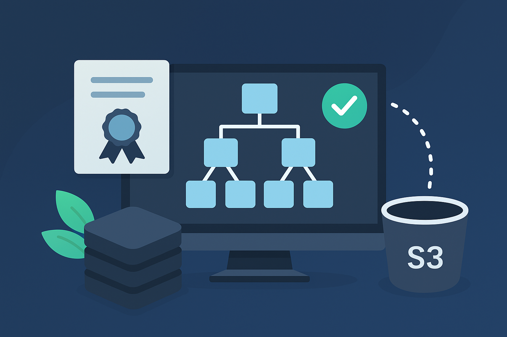
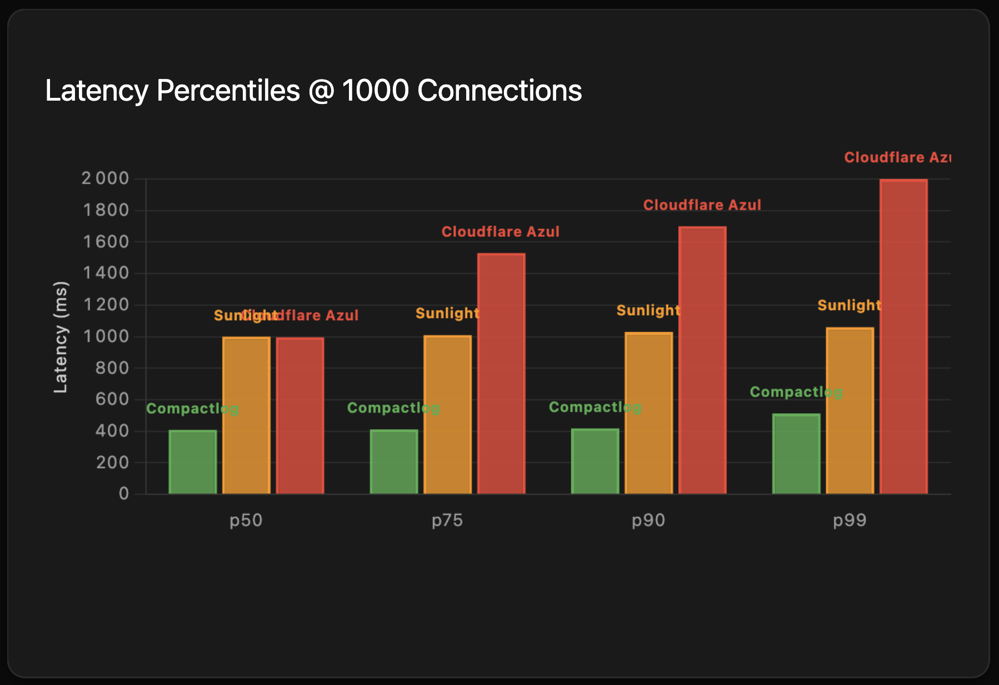
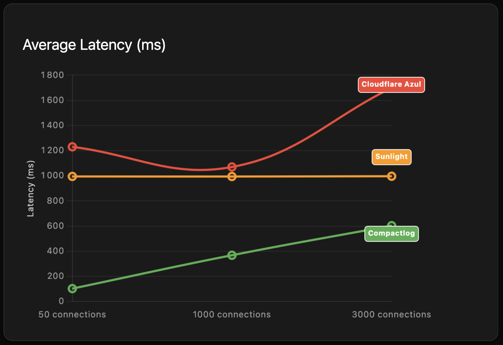
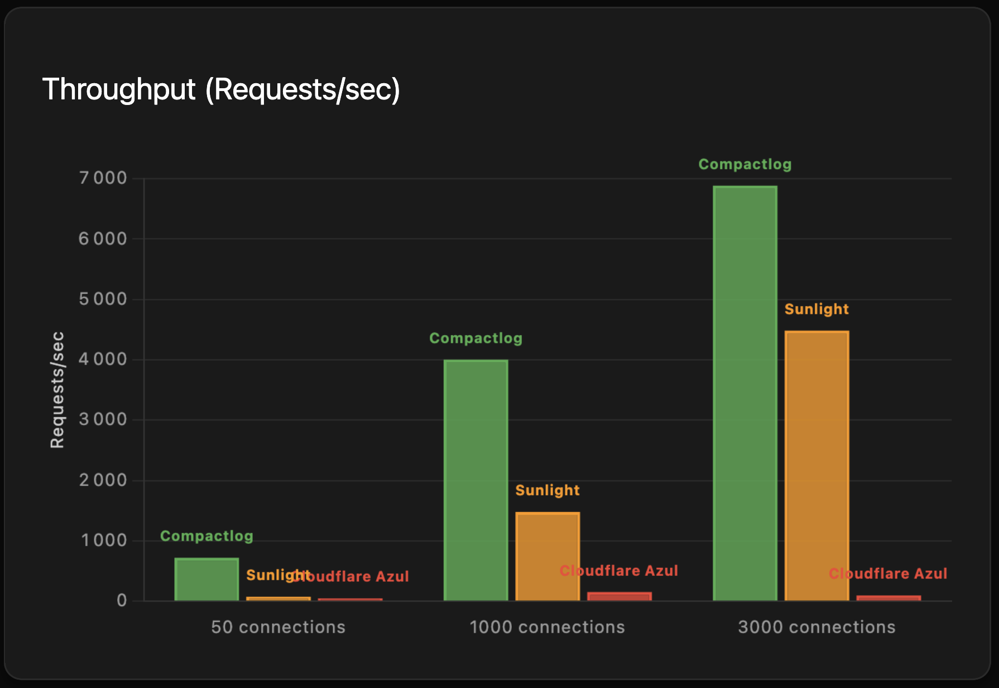
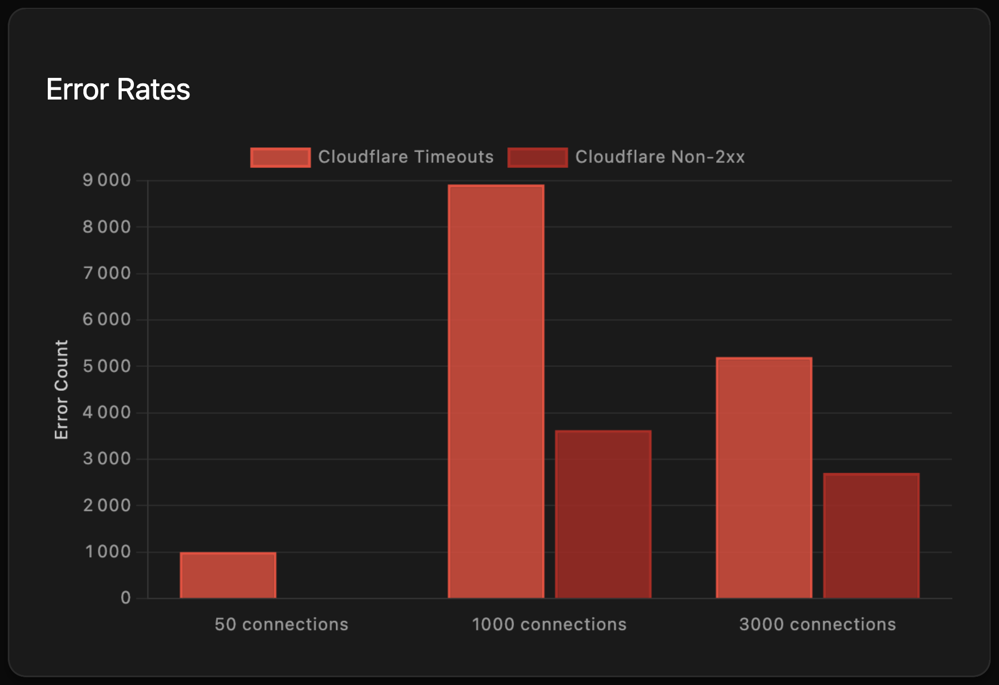
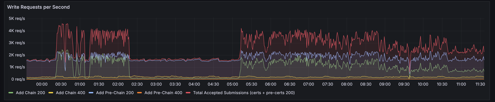
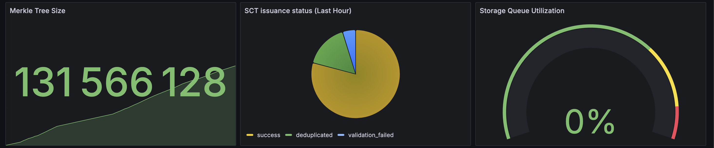
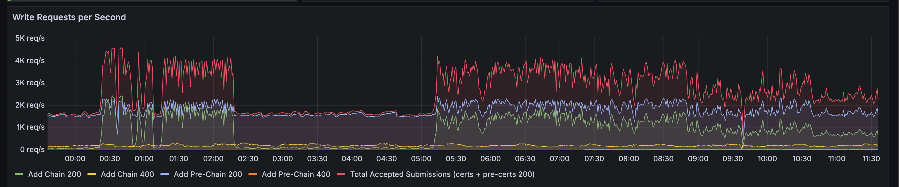
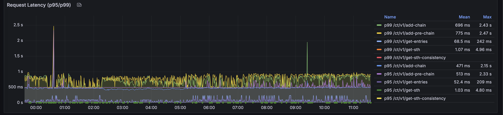
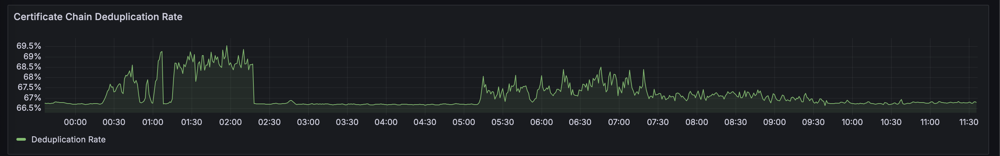

<p align="center">
  
</p>

**⚠️ This is a work in progress. While the CT functionality works, this should not be yet used in production.**

## Background

CompactLog demonstrates that the same Merkle tree can be efficiently served through both RFC 6962 and Static CT APIs from a single implementation. This challenges the narrative that RFC 6962 is fundamentally unscalable or that separate architectures are necessary.

For our analysis of the broader Certificate Transparency ecosystem and the push toward Static CT, see [why Static CT is considered harmful](https://www.merklemap.com/documentation/static-ct).

# CompactLog

A dual-API Certificate Transparency (CT) log implementation. CompactLog serves the same Merkle tree through both the RFC 6962 Certificate Transparency API and the Static CT API (C2SP draft), built on SlateDB to explore how LSM-tree storage can address traditional CT log scalability challenges.

### Live Monitoring

View real-time performance metrics and system health:

**[Live Monitoring Dashboard](https://dashboards.merklemap.com/public-dashboards/0ba4b40dda0449d7ab29ac8d6be90dd9?from=now-1h&to=now&timezone=browser)**

## Performance Benchmarks

CompactLog delivers exceptional performance compared to newer Static CT API-only implementations, while uniquely providing both RFC 6962 and Static CT APIs from the same server. Recent benchmarks demonstrate significant advantages over dedicated static-only CT servers:

<p align="center">
  
  
</p>

**Key Performance Highlights:**
- **2.5-4x lower latency** compared to Sunlight (static-only)
- **4-5x lower latency** compared to Cloudflare's Azul (static-only)
- **Linear scalability** with connection count, maintaining consistent performance under load
- All while serving both RFC 6962 and Static CT APIs simultaneously

<p align="center">
  
  
</p>

**Reliability & Throughput:**
- **Zero errors** across all connection levels (50, 1000, 3000 concurrent connections)
- **17x higher throughput** than Cloudflare Azul at 1000 connections
- **1.5x higher throughput** than Sunlight at 3000 connections

These benchmarks demonstrate that CompactLog's dual-API architecture doesn't compromise performance. By leveraging efficient batching and LSM-tree storage, it delivers better performance than specialized static-only implementations while providing the flexibility of both APIs.

## Overview

This implementation provides a complete Certificate Transparency log that:

- Accepts X.509 certificate chains and pre-certificates
- Issues Signed Certificate Timestamps (SCTs)
- Maintains a cryptographically verifiable Merkle tree
- Provides inclusion and consistency proofs via RFC 6962 API
- Serves the same tree data through Static CT API (C2SP draft)
- Stores data in cloud object storage (S3, Azure Blob) or local filesystem

## Performance Metrics

CompactLog achieves exceptional performance through its batching strategy and efficient storage design:

<p align="center">
  
  <br/>
  <em>Sustained write throughput of 3-4K requests/second across different certificate chain types</em>
</p>

### Key Performance Characteristics

- **Zero Merge Delay**: Certificates are immediately incorporated into the Merkle tree
- **High Throughput**: Sustained 3-4K certificate submissions per second
- **Low Latency**: P95 latencies under 500ms, P99 under 1 second
- **Efficient Deduplication**: ~67% certificate chain deduplication rate

<p align="center">
  
  <br/>
  <em>Real-time system metrics showing tree growth, SCT issuance success rate, and zero storage queue backlog</em>
</p>

## Storage Architecture

### Core Design Decisions

CompactLog makes three fundamental design choices that differentiate it from other CT implementations:

1. **LSM-tree storage via SlateDB** instead of relational databases or custom storage engines.
2. **STH-boundary versioning** - only persisting tree state at published checkpoints.
3. **Synchronous tree updates** - achieving a Maximum Merge Delay (MMD) of 0 seconds.

### How MMD is Eliminated Entirely

Many CT log implementations have a Merge Delay (MD) of minutes to hours, where submitted certificates aren't yet included in the Merkle tree. This exists because:

- Many implementations issue SCTs immediately, then incorporate certificates later via background processes.
- Some implementations have expensive tree update operations.
- Consistency requires coordinating distributed components.

CompactLog eliminates a MD by reversing this order - certificates are incorporated **before** SCTs are issued:

```
Submission 1 ─┐
Submission 2 ─┼─ Wait up to 500ms ─→ Batch tree update ─→ All SCTs returned
Submission 3 ─┘                             └── Certificates already incorporated
```

The 500ms delay is submission latency, not a merge delay. Once SCTs are issued, certificates are already in the tree.

### Batching Strategy in Action

<p align="center">
  
  <br/>
  <em>Write request patterns showing effective batching - spikes at the beginning represent batch formation</em>
</p>

The batching system:

- Collects submissions for up to 500ms (configurable) to form a batch
- Updates the Merkle tree once for the entire batch
- Returns SCTs only after certificates are incorporated in the tree
- No background processing - certificates are immediately available for proofs

### Request Latency Profile

<p align="center">
  
  <br/>
  <em>P95 and P99 latencies showing consistent sub-second response times across all operation types</em>
</p>

The latency profile demonstrates:

- **P95 add-chain**: 471ms (includes batching delay)
- **P95 add-pre-chain**: 513ms
- **P95 get operations**: 52-68ms
- **P99 latencies**: Generally under 1 second

### Traditional vs CompactLog Timing

**Traditional CT implementations:**

```
Submit cert → Issue SCT immediately → [MMD period] → Incorporate in tree
```

**CompactLog:**

```
Submit cert → [Batch delay ≤500ms] → Incorporate in tree → Issue SCT
```

Result: Traditional logs have MMD measured in minutes/hours; CompactLog has an MMD of 0 seconds.

### STH-Boundary Versioning

CompactLog versions nodes only at STH publication boundaries:

- Update nodes in-memory during batch operations  
- Store O(log n) versioned nodes only at STH publication
- With STHs every k certificates: reduces versioned storage from O(n log n) to O(n log n / k)

**Example**: Publishing STHs every 1000 certificates reduces versioned storage overhead by 1000x.

### Storage Schema

```
# Core data
leaf:{index} → certificate/precert data
vnode:{node}@{version} → node hash (version = STH boundary)
nver:{node} → latest version of node

# Operational state
meta → current tree size
committed_size → last STH boundary
hash:{leaf_hash} → tree index
cert_sct:{cert_hash} → SCT data

# Certificate storage (deduplication)
cert:{cert_hash} → certificate binary data
entry:{index} → deduplicated log entry
```

### Certificate Chain Deduplication

<p align="center">
  
  <br/>
  <em>Consistent ~67% deduplication rate for certificate chains, significantly reducing storage requirements</em>
</p>

CompactLog stores certificate chains using content-addressable storage:

1. **Entry structure**: Each log entry stores SHA-256 hashes of certificates rather than the certificates themselves
2. **Certificate store**: Certificates are stored separately under `cert:{hash}` keys
3. **Deduplication**: Multiple entries referencing the same certificate (e.g., intermediate CA certs) share the same stored copy
4. **Reconstruction**: The API reconstructs full certificate chains by resolving hash references during retrieval

The `DeduplicatedLogEntry` structure contains:

- Certificate hash (32 bytes)
- Chain certificate hashes (array of 32-byte hashes)
- Original metadata (timestamp, index, entry type)

### Consistency Model

Every operation maintains strict consistency:

- Reads see the latest committed STH state
- Writes are serialized through asynchronous locking (synchronous from client perspective)
- Proofs only available at STH boundaries (ensuring stable references)
- No eventual consistency - all operations are immediately visible

## Architectural Approach

### The Static CT API Design Challenge

The Static CT API was designed to serve immutable tiles from simple storage (like CDNs), but implementations still face fundamental challenges:

1. **Sequencing**: Certificates must be assigned sequential indices
2. **Deduplication**: Preventing duplicate entries requires state
3. **Coordination**: Multiple writers need consistency guarantees
4. **Atomicity**: Tiles must reflect a consistent tree state

Many implementations require or heavily depend on external databases for:
- Deduplication tracking and caching
- Write coordination between multiple processes
- Sequencing and state management
- Staging and crash recovery mechanisms

### CompactLog's Approach

CompactLog uses a single LSM-tree database (SlateDB) that stores its data directly on cloud object storage (S3, Azure Blob) or POSIX filesystem. The same database handles:

- Certificate sequencing through atomic batch operations
- Deduplication via content-addressable storage keys
- Tree versioning at STH boundaries
- On-demand tile generation from stored nodes

While CompactLog generates tiles dynamically rather than storing pre-computed files, its underlying storage consists entirely of immutable objects in cloud storage or append-only files on disk. All coordination, deduplication, and sequencing happen through this single storage layer without requiring additional databases or complex write pipelines.

This design trades direct CDN serving of pre-generated tiles for a much simpler write path and operational model. The LSM-tree structure naturally fits CT's workload pattern - primarily appending new certificates while efficiently serving historical tree states at any STH boundary - all while leveraging the same cloud object storage that would typically host static tiles.

## Configuration

Create `Config.toml` or let the system generate defaults:

```toml
[server]
bind_addr = "0.0.0.0:8080"

[storage]
provider = "local"  # "aws", "azure", or "local"

[storage.local]
path = "/tmp/ct-log-storage"

[keys]
private_key_path = "keys/private_key.pem"
public_key_path = "keys/public_key.pem"
```

For cloud storage, configure provider-specific credentials in the respective sections.

## Running

```bash
# Start with default local configuration
cargo run --release

# With debug logging
RUST_LOG=debug cargo run --release
```

The system automatically generates ECDSA P-256 keys and default configuration if not present.

## API Endpoints

CompactLog exposes both RFC 6962 and Static CT API endpoints on the same server:

### RFC 6962 API
- `POST /ct/v1/add-chain` - Submit certificate chain
- `POST /ct/v1/add-pre-chain` - Submit pre-certificate chain  
- `GET /ct/v1/get-sth` - Get signed tree head
- `GET /ct/v1/get-entries` - Get log entries
- `GET /ct/v1/get-proof-by-hash` - Get inclusion proof by hash
- `GET /ct/v1/get-entry-and-proof` - Get entry and inclusion proof
- `GET /ct/v1/get-sth-consistency` - Get consistency proof
- `GET /ct/v1/get-roots` - Get accepted root certificates

### Static CT API (C2SP)
- `GET /checkpoint` - Get current checkpoint (signed note format)
- `GET /tile/{level}/{index}` - Get Merkle tree tile
- `GET /tile/data/{index}` - Get data tile (gzip compressed)
- `GET /issuer/{fingerprint}` - Get issuer certificate by SHA-256 fingerprint

Both APIs serve the exact same Merkle tree data, just in different formats suited to their respective use cases.
